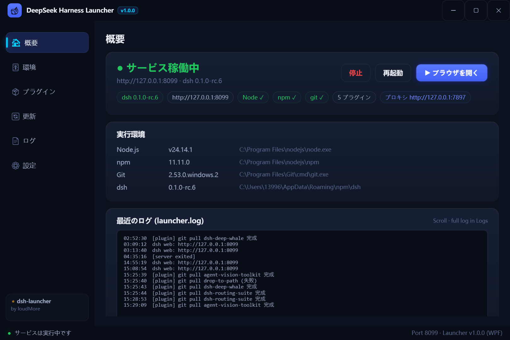

# dsh-launcher

> DeepSeek Harness (dsh) のらくらくランチャー：**ダブルクリックで起動、ワンクリックでインストール・更新・メンテナンス**。Node.js・dsh・プラグインすべてお任せ、中国ミラー自動フォールバック付き。

[English](README.md) | [中文](README.zh.md) | [日本語](README.ja.md) | [한국어](README.ko.md) | [Русский](README.ru.md)

[](https://github.com/topics/dsh-launcher)
[](../../releases)
[](./LICENSE)

## スクリーンショット

| 概要 (Overview) |
|---|
|  |

## なぜこのランチャーか

dsh をセットアップするには Node.js のインストール、npm コマンド、レジストリ設定が必要。更新もプラグイン管理も手間がかかります。**このランチャーはそれらを 1 つの exe にまとめました。**

```
ダブルクリック → スプラッシュ → 「インストール」→ コーヒーを一杯 → 「起動」→ ブラウザが開く
```

## 主な機能

- 🎨 **モダン WPF UI** — GPU 合成レンダリング、PerMonitorV2 高 DPI 対応、ダーク/ライト双テーマ即時切替、角丸カード・微光・なめらかなアニメーション
- 🎯 **ワンクリックインストール** — 環境自動検出 → Node.js 自動ダウンロード（公式→中国ミラー）、**カスタムインストール先対応**（PATH に永続化）
- ▶️ **ワンクリック起動** — 状態に応じてボタンが変化（インストール/起動/ブラウザを開く + 停止/再起動）、常駐モニターで UI と実状態を常時同期
- 🔄 **3方向アップデート** — ランチャー（GitHub version.txt）/ dsh（npm）/ プラグイン（git）を現在・最新で表示、スピナー付き確認アニメーション
- 🧩 **プラグイン管理** — git URL / npm パッケージ名でインストール、スマート更新（リモートに新コミットがある時のみ pull、最新なら誤って失敗表示しない）、ワンクリックメンテナンス
- 🛍️ **プラグインストア** — GitHub 複数キーワード + npm 公式 + Awesome リストを集約、星/言語/更新日表示、インストール済みは ✓ 表示
- 🌉 **自動プロキシ** — Clash / v2rayN 等を自動検出（設定→環境変数→システムプロキシ→ポートスキャン）
- 🌐 **多言語対応** — 中文 / English / 日本語 / 한국어 / Русский / Français / Deutsch / Español（国旗アイコンで切替）
- 🖱️ **モダントレイメニュー** — WPF フローティングカードメニュー、閉じるとトレイへ、単一インスタンス
- 📄 **ログビューア** — ターミナル風ログ、フィルタ・コピー・クリア対応

## クイックスタート

1. [Releases](../../releases) から `DeepSeekHarness.exe` をダウンロード（ビルド不要・インストール不要）
2. ダブルクリック → **インストール**（既に dsh がある場合はスキップ）
3. **起動** → 完了

設定は「設定」ページで管理され、exe と同じフォルダの `launcher.json` に保存されます。

## ライセンス

[MIT](./LICENSE)
