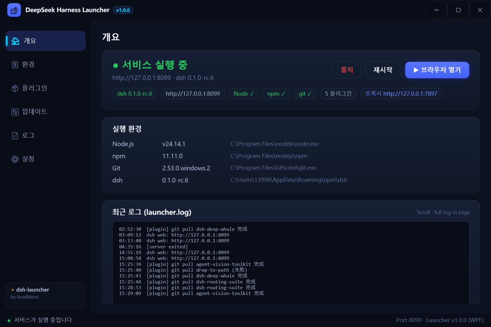

# dsh-launcher

> DeepSeek Harness (dsh)를 위한 간편 실행기: **더블클릭 실행, 원클릭 설치·업데이트·유지보수** — Node.js, dsh, 플러그인 모두 처리, 중국 미러 자동 폴백 포함.

[English](README.md) | [中文](README.zh.md) | [日本語](README.ja.md) | [한국어](README.ko.md) | [Русский](README.ru.md)

## 스크린샷

| 개요 (Overview) |
|---|
|  |

## 왜 이 실행기가 필요한가

dsh를 설치하려면 Node.js 설치, npm 명령어, 레지스트리 설정이 필요합니다. 업데이트와 플러그인 관리도 번거롭습니다. **이 실행기는 dsh 관리를 GUI로 담은 초보자용 도구입니다:**

- 🎯 **환경 감지 + 원클릭 설치**：Node.js가 없어도 자동 설치(사용자 지정 경로 지원), dsh도 원클릭
- 🔄 **원클릭 유지보수**：dsh 업데이트·전체 플러그인 업데이트·의존성 복구를 한 번에
- 🧩 **시각적 플러그인 관리**：스토어에서 선택 설치, 의존성 자동 복구, 고장난 플러그인 자동 격리
- 🖥️ **바로 사용 가능**：더블클릭 → 「시작」 → 브라우저가 열림. 명령줄 불필요

## 주요 기능

- 🎨 **모던 WPF UI** — GPU 합성 렌더링, PerMonitorV2 고해상도 대응, 다크/라이트 테마 즉시 전환, 둥근 카드·미세 광택·부드러운 애니메이션
- 🎯 **원클릭 설치** — 환경 자동 감지 → Node.js 자동 다운로드(공식→중국 미러), **사용자 지정 설치 경로 지원**(PATH에 영구 저장)
- ▶️ **원클릭 시작** — 상태에 따라 버튼 변화(설치/시작/브라우저 열기 + 중지/재시작), 상주 모니터로 UI와 실제 상태 항상 동기화
- 🔄 **3방향 업데이트** — 실행기(GitHub version.txt)/dsh(npm)/플러그인(git)을 현재·최신으로 표시, 스피너 애니메이션 포함
- 🧩 **플러그인 관리** — git URL / npm 패키지명으로 설치, 스마트 업데이트(리모트에 새 커밋이 있을 때만 pull, 최신이면 실패로 표시하지 않음)
- 🛍️ **플러그인 스토어** — GitHub 다중 키워드 + npm 공식 + Awesome 목록 집계, 별/언어/업데이트일 표시, 설치 완료는 ✓ 표시
- 🌉 **자동 프록시** — Clash / v2rayN 등을 자동 감지(설정→환경변수→시스템 프록시→포트 스캔)
- 🌐 **다국어 지원** — 中文 / English / 日本語 / 한국어 / Русский / Français / Deutsch / Español(국기 아이콘으로 전환)
- 🖱️ **모던 트레이 메뉴** — WPF 플로팅 카드 메뉴, 닫으면 트레이로, 단일 인스턴스
- 📄 **로그 뷰어** — 터미널 스타일 로그, 필터·복사·지우기 지원

## 빠른 시작

1. [Releases](../../releases)에서 `DeepSeekHarness.exe` 다운로드(빌드 불필요·설치 불필요)
2. 더블클릭 → **설치**(이미 dsh가 있으면 건너뛰기)
3. **시작** → 완료

설정은 「설정」 페이지에서 관리되며 exe와 같은 폴더의 `launcher.json`에 저장됩니다.

## 라이선스

[MIT](./LICENSE)
