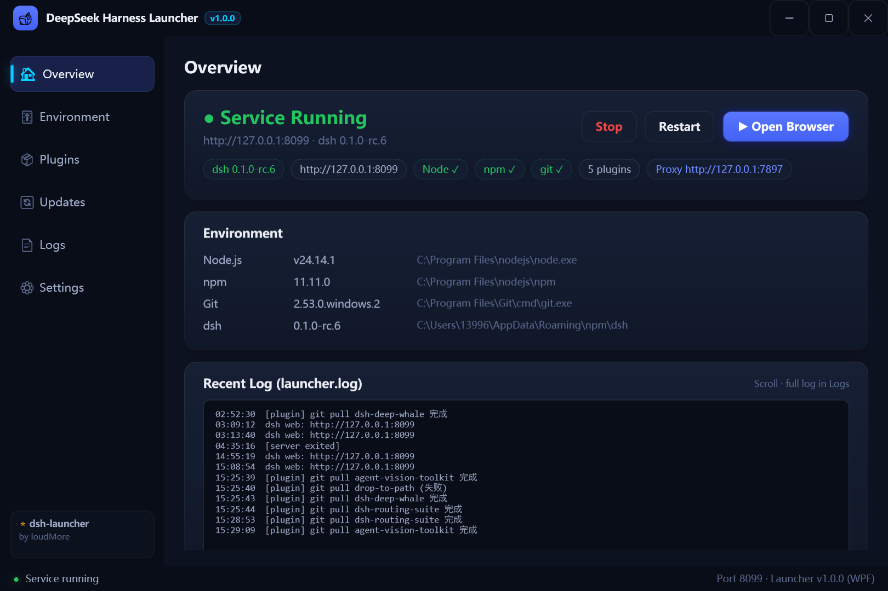
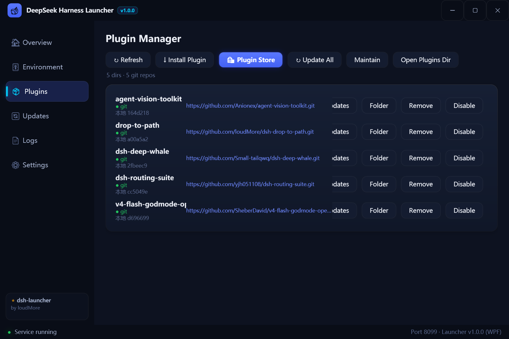
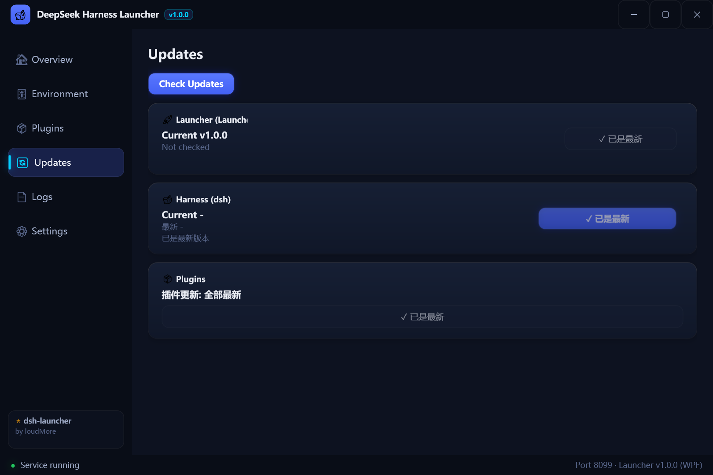
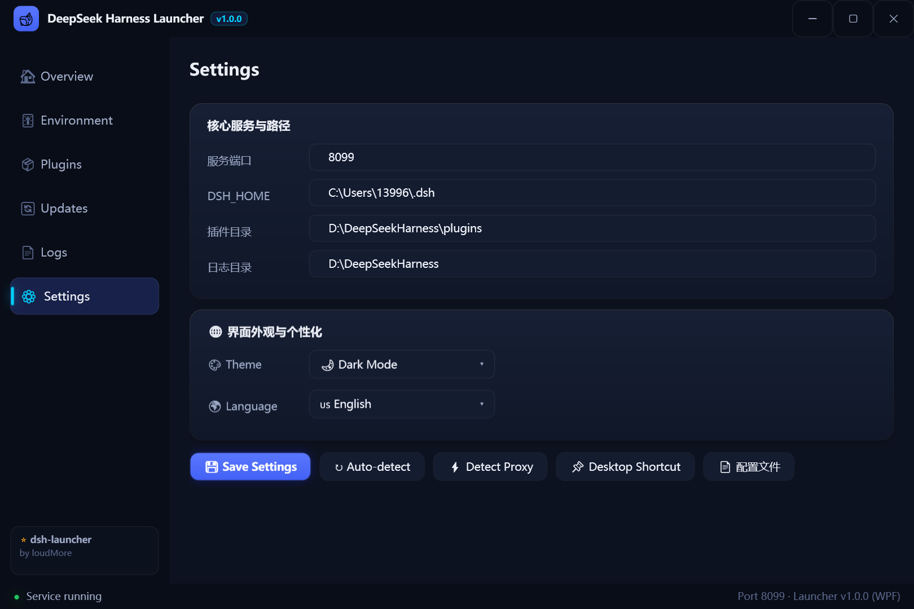
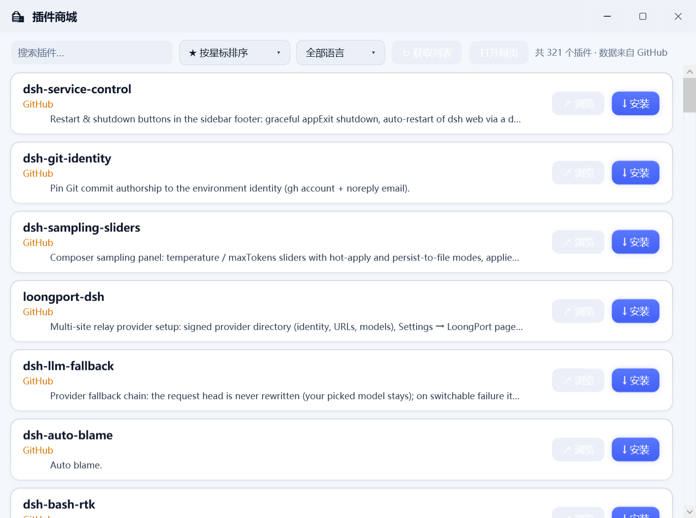
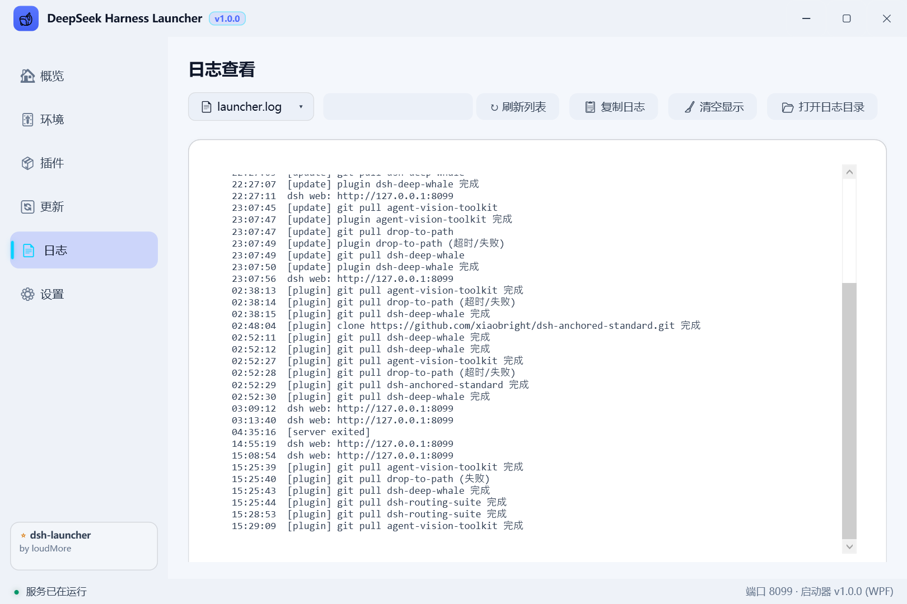

# 🐋 dsh-launcher — DeepSeek Harness 启动器

> **A beginner-friendly launcher & manager for DeepSeek Harness (dsh).**  
> **给小白用的 DeepSeek Harness 管理工具——管理 dsh、插件、环境，一键全搞定。**

| 🇨🇳 中文 | 🇺🇸 English | 🇯🇵 日本語 | 🇰🇷 한국어 | 🇷🇺 Русский |
|---|---|---|---|---|
| [README.zh.md](README.zh.md) | [README.md](README.md) | [README.ja.md](README.ja.md) | [README.ko.md](README.ko.md) | [README.ru.md](README.ru.md) |

[](https://github.com/topics/dsh-launcher)
[](../../releases)
[](./LICENSE)
[](../../releases)

---

## ✨ 这是什么 / What is this?

**DeepSeek Harness (dsh) 的傻瓜式桌面管理工具**，把 dsh 的安装、启动、更新、插件维护全部收进一个图形界面，**不用敲一行命令**。

**A one-stop desktop manager for DeepSeek Harness (dsh)** — install, launch, update and maintain dsh & its plugins in a GUI. **No CLI needed.**

### 🎯 核心亮点 / Highlights

| | 中文 | English |
|---|---|---|
| 🧩 **管理 dsh & 插件** | 图形化管理所有插件：安装、更新、修复依赖、启用/禁用、一键维护；缺依赖自动修复，坏插件自动隔离不拖垮服务 | Visually manage plugins: install, update, fix deps, toggle, one-click maintain; auto-fix missing deps, auto-quarantine broken plugins |
| 🔄 **一键更新 & 维护** | 启动器 / dsh / 插件 三维更新看板，自动检查更新，一键全部升级 | 3-way update board (launcher / dsh / plugins) with auto-check and one-click upgrade |
| ⚡ **一键安装 dsh** | 没装 Node.js？自动装好（支持自定义目录）；没装 dsh？一条命令的事 | No Node.js? It installs it for you (custom path). No dsh? One click |
| 🔍 **环境检测** | 自动检测 Node / npm / Git / dsh，缺什么一目了然 | Auto-detect Node / npm / Git / dsh, see what's missing at a glance |
| 🐣 **小白友好** | 双击即用，全程图形界面，无需接触命令行 | Double-click to use, fully graphical, zero CLI |
| 🛍️ **插件商城** | 聚合 GitHub + npm + Awesome 数百插件，带星标/语言/更新日期 | Store aggregating GitHub + npm + awesome lists with stars/language/date |
| 🌉 **自动代理** | 自动探测代理 + 国内镜像兜底，网络再差也能装 | Auto proxy detection with China mirror fallbacks |
| 🎨 **美观现代** | 深/浅双主题、8 种语言、GPU 渲染 WPF 界面 | Dark/light themes, 8 languages, GPU-rendered WPF UI |

---

## Screenshots

| Overview (EN) | Plugins (EN) |
|---|---|
|  |  |

| Updates (EN) | Settings (EN) |
|---|---|
|  |  |

| Plugin Store (EN) | Logs (EN) |
|---|---|
|  |  |

**Other languages:** [中文界面](./docs/images/overview.png) · [日本語](./docs/images/overview-ja.png) · [한국어](./docs/images/overview-ko.png) · [Русский](./docs/images/overview-ru.png)

## Why this launcher

Setting up dsh normally means installing Node.js, running npm commands, dealing with registries; updating means digging out commands; plugins mean manual `git pull`. **Too much hassle.**

This launcher is **a beginner-friendly manager for dsh** — it wraps installation, updates and plugin maintenance into one GUI:

- 🎯 **Environment detection + one-click dsh install**: no Node.js? It installs it for you (custom path supported). No dsh? One click away
- 🔄 **One-click maintenance**: upgrade dsh, update all plugins, fix dependencies — all in one click
- 🧩 **Visual plugin management**: pick from the store, click to install, auto-fix missing deps, auto-quarantine broken plugins so they never crash the service
- 🖥️ **Ready out of the box**: double-click → click "Start" → browser opens. No CLI needed

| You are | Your pain | Our answer |
|---|---|---|
| 🐣 Beginner | No Node.js, afraid of the CLI | One-click install: Node.js auto-downloaded (official → China mirror fallback), dsh installed via npm (same fallback) |
| 🚀 Daily user | Open / update / plugins are annoying | A context-aware big button + one-click plugin maintenance |
| 🔧 Power user | Version chaos, broken deps | 3-way version board (launcher / dsh / plugins) + logs + dependency repair |

## Features

- 🎨 **Modern WPF UI** — GPU-composited rendering, PerMonitorV2 DPI-aware, dark/light dual themes with instant hot-switching, rounded cards with subtle gradients & glow, fluent page transitions, slim adaptive scrollbars
- 🎯 **One-click Install** — auto-detect environment → install Node.js if missing (mirror fallback, **custom install path supported**, persisted into user PATH) → npm install dsh (mirror fallback)
- ▶️ **One-click Start** — the big button morphs by state: *Install* / *Start* / *Open Browser* + stop / restart; a resident service-state watcher keeps the UI always in sync with the real port status
- 🔄 **3-way Update Strategy** — launcher (GitHub `version.txt`), dsh (npm), plugins (git) all show **current / latest** with animated checking indicator; fetched automatically on launch and every 3 hours; state-aware buttons (`✓ already latest` disabled) refresh right after updates
- 🧩 **Plugin Manager** — install via **git URL** or **npm package name**; per-plugin smart update (only pulls when the remote truly has new commits — no false "failed" on up-to-date repos), remove, enable/disable, one-click maintain (update all + fix deps)
- 🛍️ **Plugin Store** — standalone store window aggregating **GitHub multi-keyword search + npm official registry + awesome lists**: stars / language / last-update per card, fuzzy search, sort by stars or name, language filter, installed plugins auto-marked ✓ (non-clickable), one-click install
- 🌉 **Auto proxy** — detects Clash / v2rayN and friends automatically (config → environment → Windows system proxy → common-port scan) and routes npm / git / updates through it; China-friendly mirror fallbacks for npm & Node.js
- 🌐 **Multi-language UI** — follows the system language by default, manual **zh / en / ja / ko / ru / fr / de / es** switch with flag icons
- 🖱️ **Modern system tray** — WPF floating rounded-card context menu (open launcher / start / stop / restart / browser / store / theme switch / exit), close-to-tray, single instance
- 🧩 **Modern dialogs** — all prompts/confirmations replaced with theme-aware rounded glass dialogs
- 📄 **Log viewer** — terminal-style log page with source switch (launcher.log / dsh.log), real-time filter, copy & clear
- 🛡️ **Robust** — crash.log on unhandled exceptions, actionable error hints, atomic smooth page rendering
- 📐 **Hi-DPI responsive** — runtime DPI scaling; borderless resize & maximize (native WindowChrome)

## Quick start

1. Download `DeepSeekHarness.exe` from [Releases](../../releases) — **no build, no install**
2. Double-click → click **Install** (skip if dsh is already set up)
3. Click **Start** → done

All settings live in the Settings page and persist to `launcher.json` next to the exe.

## Self-update & mirrors

- The launcher checks `version.txt` in this repo and offers a one-click download of new releases
- npm falls back to `https://registry.npmmirror.com` when the official registry fails
- Node.js falls back to `https://npmmirror.com/mirrors/node/`
- Both are configurable in Settings

## Development

WPF source (code-only, no XAML toolchain) in [`wpf/`](./wpf/README.md) — double-click `build.bat` to compile (no Visual Studio needed, ships with .NET Framework 4.8's compiler + GAC WPF assemblies).

```
dsh-launcher/
├─ wpf/
│  ├─ WpfApp.cs           # shell UI: titlebar/sidebar/6 pages/tray/splash/dialogs
│  ├─ Logic.cs            # config / env / proxy / service / plugins / store / updates / lang
│  ├─ StoreWindow.cs      # plugin store window
│  ├─ build.bat           # one-click build (csc + GAC WPF)
│  └─ app.manifest        # PerMonitorV2 Hi-DPI aware
├─ version.txt            # version source for self-update
└─ .github/workflows/     # tag → auto build exe → publish Release
```

**Release flow**: bump the version strings in `WpfApp.cs` → sync `version.txt` → push & tag (`v*`) → CI builds and publishes the exe.

## Contributing

Issues & PRs welcome: feature ideas, translations (the `Lang` dictionary), bug fixes.

## Notes

- Official DeepSeek logo assets are not included in the repo — supply your own same-named files under `wpf/` (`build.bat` builds fine without them)
- Not an official DeepSeek product; just a handy launcher/maintainer for dsh

## License

[MIT](./LICENSE)
