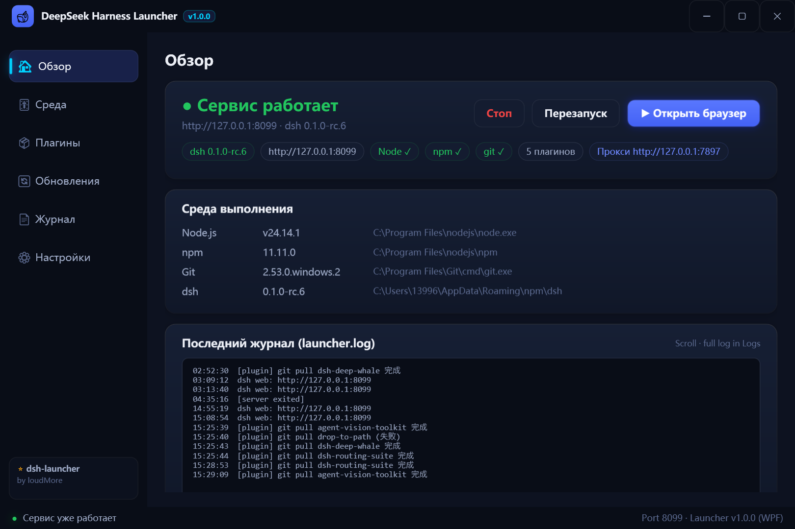

# dsh-launcher

> Простой лаунчер для DeepSeek Harness (dsh): **двойной клик для запуска, один клик для установки, обновления и обслуживания** — Node.js, dsh и плагины под контролем, с автоматическим фолбэком на китайские зеркала.

[English](README.md) | [中文](README.zh.md) | [日本語](README.ja.md) | [한국어](README.ko.md) | [Русский](README.ru.md)

[](https://github.com/topics/dsh-launcher)
[](../../releases)
[](./LICENSE)

## Скриншоты

| Обзор (Overview) |
|---|
|  |

## Зачем этот лаунчер

Установка dsh обычно требует установки Node.js, команд npm и настройки реестров; обновление — поиска команд; плагины — ручного `git pull`. **Слишком много хлопот.** Этот лаунчер упаковывает всё это в **один exe**:

```
двойной клик → заставка → «Установить» → кофе → «Запуск» → браузер открывается
```

## Возможности

- 🎨 **Современный WPF-интерфейс** — GPU-рендеринг, PerMonitorV2 для чёткости на любом DPI, тёмная/светлая темы с мгновенным переключением, скруглённые карточки с мягкими тенями и анимациями
- 🎯 **Установка в один клик** — автодетект окружения → автоскачивание Node.js (официальный → китайское зеркало), **поддержка пользовательского пути установки** (сохраняется в PATH)
- ▶️ **Запуск в один клик** — кнопка меняется по состоянию (Установить / Запуск / Открыть браузер + Стоп / Перезапуск), резидентный монитор держит UI синхронизированным с реальным состоянием
- 🔄 **Обновления по 3 направлениям** — лаунчер (GitHub version.txt) / dsh (npm) / плагины (git) с отображением текущей и последней версий, анимация проверки
- 🧩 **Менеджер плагинов** — установка по git URL или npm-пакету, умное обновление (pull только при реально новых коммитах — не показывает ложных ошибок), обслуживание в один клик
- 🛍️ **Магазин плагинов** — агрегация GitHub (несколько ключевых слов) + npm + Awesome-списки, звёзды/язык/дата обновления, установленные помечаются ✓
- 🌉 **Авто-прокси** — автоопределение Clash / v2rayN и др. (конфиг → переменные среды → системный прокси → сканирование портов)
- 🌐 **Многоязычность** — 中文 / English / 日本語 / 한국어 / Русский / Français / Deutsch / Español (переключение по флагам)
- 🖱️ **Современное меню в трее** — плавающая карточка WPF, закрытие сворачивает в трей, один экземпляр
- 📄 **Просмотр логов** — терминальный стиль, фильтр / копирование / очистка

## Быстрый старт

1. Скачайте `DeepSeekHarness.exe` из [Releases](../../releases) — **без сборки и установки**
2. Двойной клик → **Установить** (пропустите, если dsh уже настроен)
3. **Запуск** → готово

Все настройки — на странице «Настройки», сохраняются в `launcher.json` рядом с exe.

## Лицензия

[MIT](./LICENSE)
