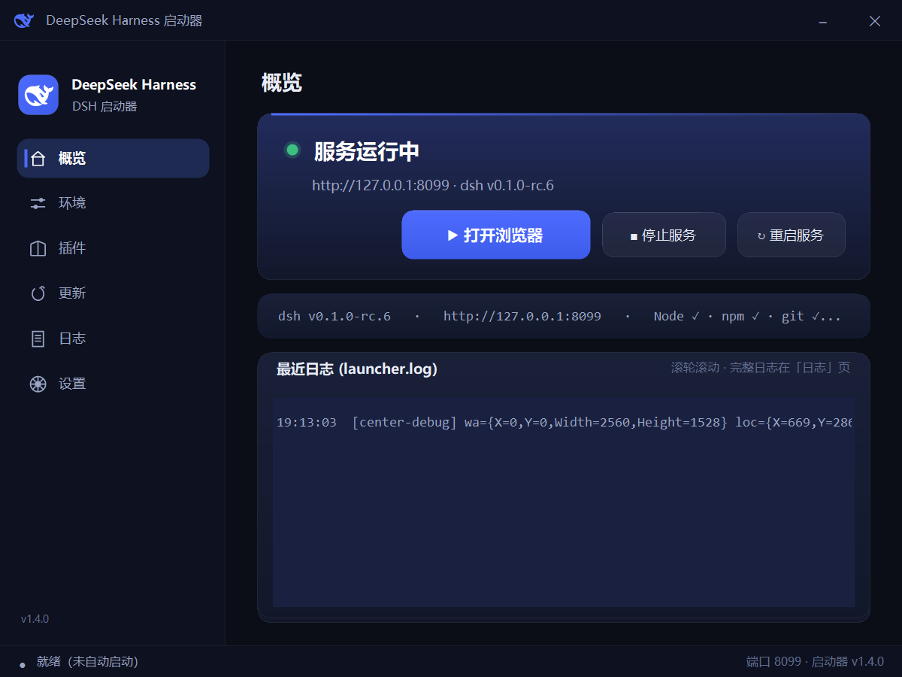
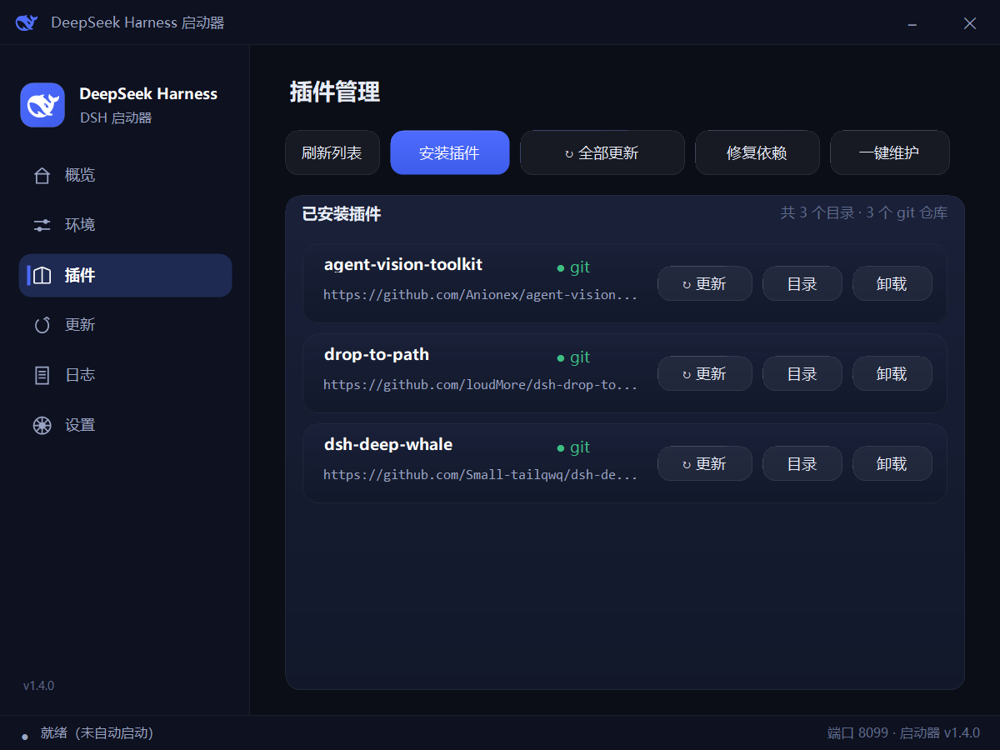
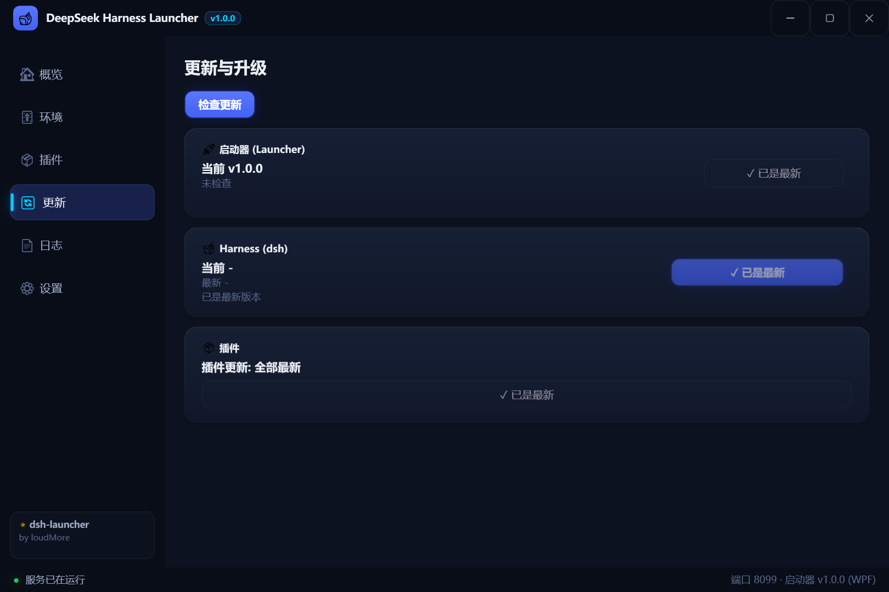
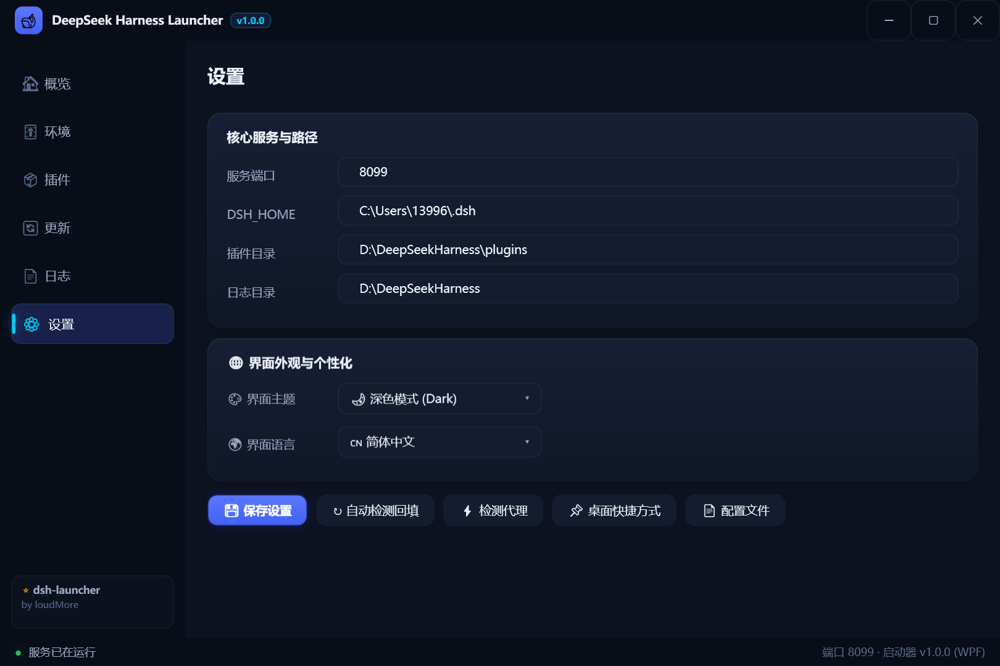
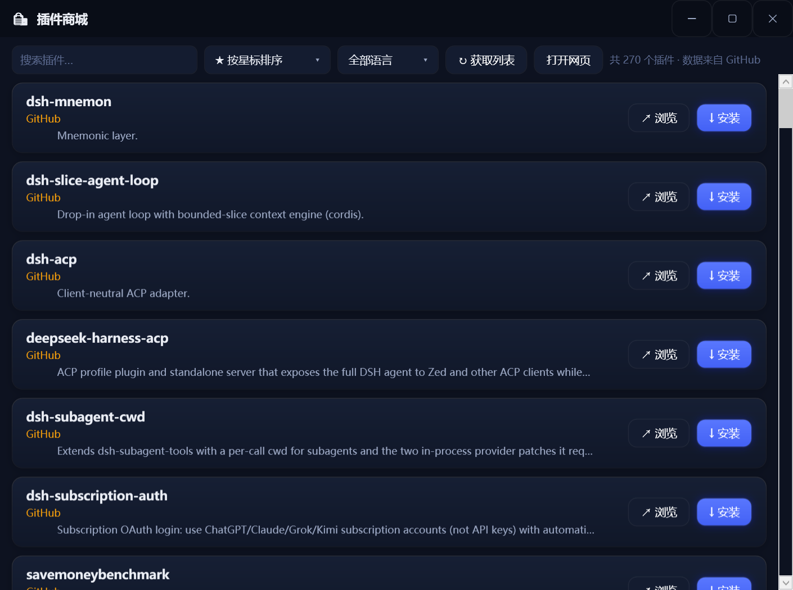

# dsh-launcher

> DeepSeek Harness (dsh) 傻瓜式启动器：**双击即用、一键安装、一键更新、一键维护**——Node.js、dsh、插件全包办，带国内镜像兜底。

[English](README.md) | [中文](README.zh.md)

[](https://github.com/topics/dsh-launcher)
[](../../releases)
[](./LICENSE)
[](../../releases)

## 界面预览

| 概览 | 插件管理 |
|---|---|
|  |  |

| 更新中心 | 设置 |
|---|---|
|  |  |

| 插件商城 |
|---|
|  |

## 为什么需要它

装 dsh 要装 Node.js、要敲 npm 命令、要折腾镜像源；更新要查命令；插件要手动 `git pull`……**太麻烦了。**

这个启动器把这一切打包成**一个 exe**：

```
双击 → 过渡动画 → 点「一键安装」→ 喝杯水回来 → 点「一键启动」→ 浏览器自动打开
```

| 你的身份 | 你的痛 | 我们的解 |
|---|---|---|
| 🐣 纯小白 | 没装 Node.js，怕命令行 | 「一键安装」自动下载 Node.js（官方源失败自动切国内镜像）并 npm 安装 dsh（同样镜像兜底） |
| 🚀 日常用户 | 打开/更新/换插件麻烦 | 首页一个会变身的大按钮 + 插件页一键维护 |
| 🔧 折腾党 | 版本混乱、依赖报错 | 三维版本看板（启动器/dsh/插件）+ 日志 + 修复依赖 |

## 核心功能

- 🎯 **一键安装**：自动检测环境 → 缺 Node.js 自动下载解压（镜像兜底）→ npm 安装 dsh（镜像兜底），全程进度提示
- ▶️ **一键启动**：大按钮随状态自动变身——未安装→「一键安装」、未启动→「一键启动」、运行中→「打开浏览器」+ 停止/重启，服务就绪自动打开 `http://127.0.0.1:8099`
- 🔄 **三维更新策略**：启动器（GitHub `version.txt`）、dsh（npm）、插件（git）的**当前/最新版本**一目了然；启动时与每 3 小时**自动后台获取**，无需手动点
- 🧩 **插件管理**：显示仓库地址/分支/可更新徽标，每个插件标注**本地/最新版本**；支持 git URL 克隆安装、npm 包名安装、单个更新、卸载、**一键维护**（全部更新+修复依赖）
- 🛍️ **插件商城**：独立商城窗口展示 GitHub `topic:dsh-plugin` 插件——每张卡片含**星标数/语言/最近更新日期**，支持**多关键词模糊搜索、按星标或名称排序、按语言筛选**，一键安装 + 「浏览」直达仓库页；列表**启动时预热 + 本地缓存 + 后台静默刷新**，打开即出结果，无需手动点「获取列表」
- 🌉 **全自动代理**：自动探测 Clash / v2rayN 等本地代理（手动配置 → 环境变量 → Windows 系统代理 → 常见端口扫描），npm/git/更新自动走代理；npm 与 Node.js 国内镜像自动兜底，全程无需用户操心
- 🌐 **中英双语界面**：默认跟随系统语言，可手动切换（带国旗）；导航与配置项配矢量图标
- 🛡️ **稳健容错**：崩溃自动记录 crash.log；错误提示直给解法（缺依赖→一键修复）；深色主题对话框；整页原子渲染，切换页面无条带撕裂
- 🖥️ **系统托盘**：关窗不退出、托盘常驻；单实例防重开
- 📐 **高 DPI 响应式**：运行时读取系统缩放系数，窗口大小/位置按实际屏幕计算，任意分辨率适配；无边框窗口支持四边拖拽缩放与最大化

## 快速开始

1. 到 [Releases](../../releases) 下载 `DeepSeekHarness.exe`（**无需编译、无需安装**）
2. 双击运行 → 点「**一键安装**」（已装好可跳过）
3. 点「**一键启动**」→ 完事

所有设置都在「设置」页可视化修改，自动保存为 exe 同目录的 `launcher.json`。

## 自更新与镜像

- 启动器自更新指向本仓库 `version.txt`，发现新版本一键下载
- npm 官方源失败自动回退 `https://registry.npmmirror.com`
- Node.js 官方源失败自动回退 `https://npmmirror.com/mirrors/node/`
- 均可在设置中自定义

## 参与开发

单文件源码 `Launcher.cs`，双击 `build.bat` 即可编译（**无需 Visual Studio**，.NET Framework 4.0 自带编译器）。

```
dsh-launcher/
├─ Launcher.cs          # 全部源码（单文件）
├─ build.bat            # 一键编译（自动检测图标资源）
├─ app.manifest         # 高 DPI 感知
├─ version.txt          # 版本号（自更新源）
└─ .github/workflows/   # 打 tag 自动构建 exe 发布 Release
```

**发布流程**：改 `LauncherVersion` → 同步 `version.txt` → 推送打 tag（`v*`）→ CI 自动出 Release。

## 贡献

欢迎 Issue / PR：功能建议、多语言词条（`Lang` 字典）、bug 修复。

## 说明

- DeepSeek 官方 Logo 等图标资源未包含在本仓库，请自备同名文件（build.bat 支持无图标模式构建）
- 本工具非 DeepSeek 官方出品，仅作为 dsh 的便捷启动/维护器

## License

[MIT](./LICENSE)
